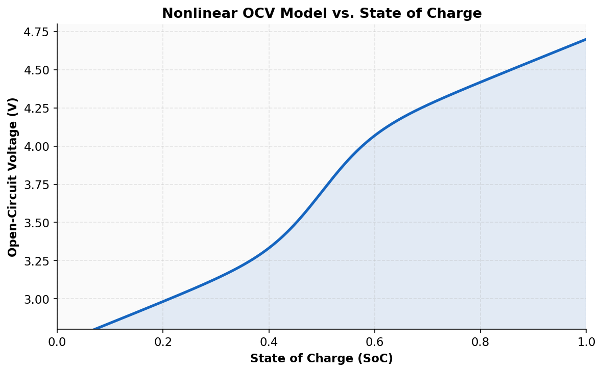
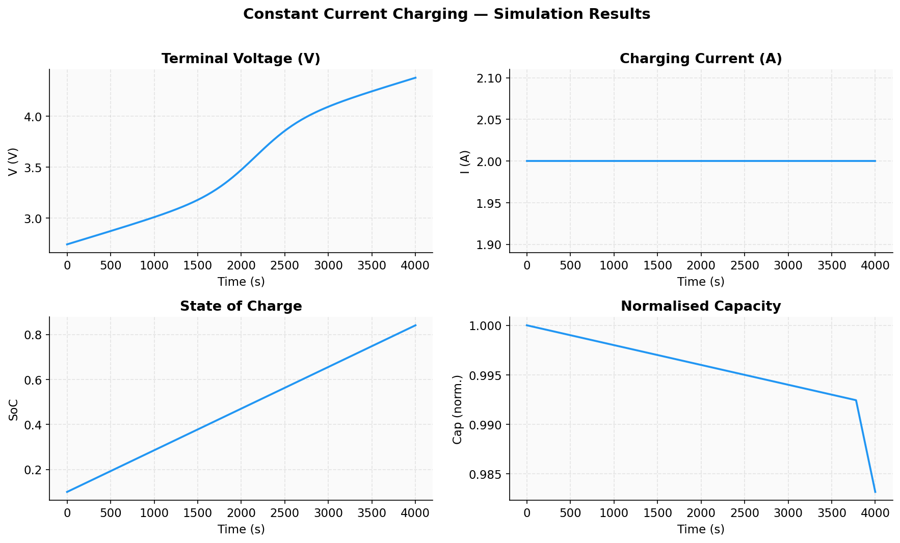
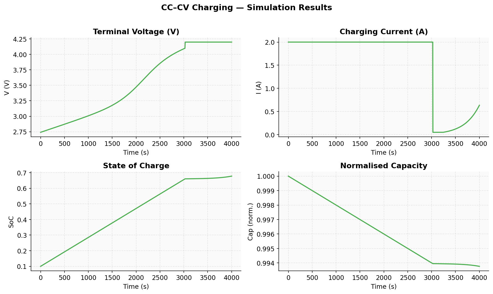
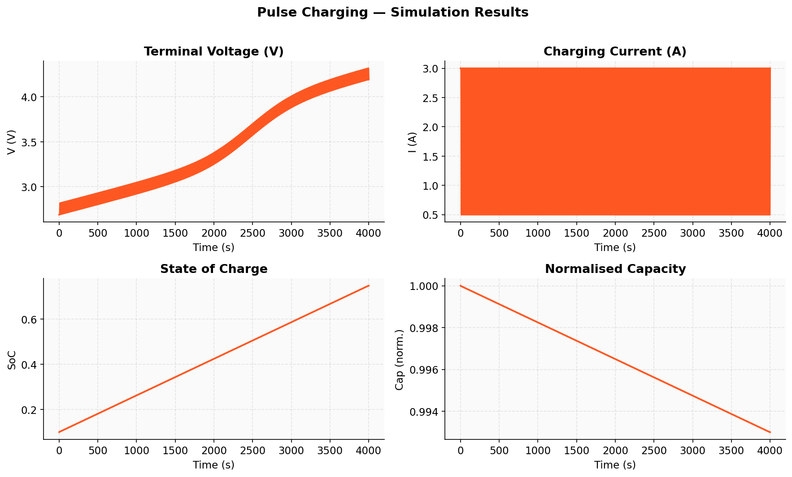
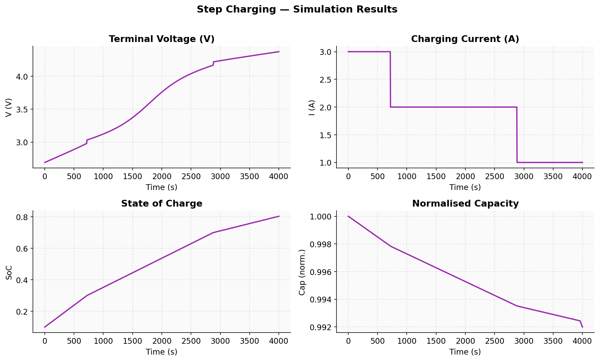
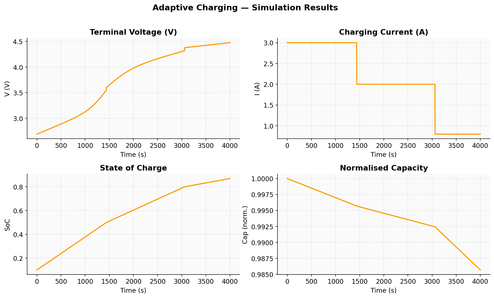
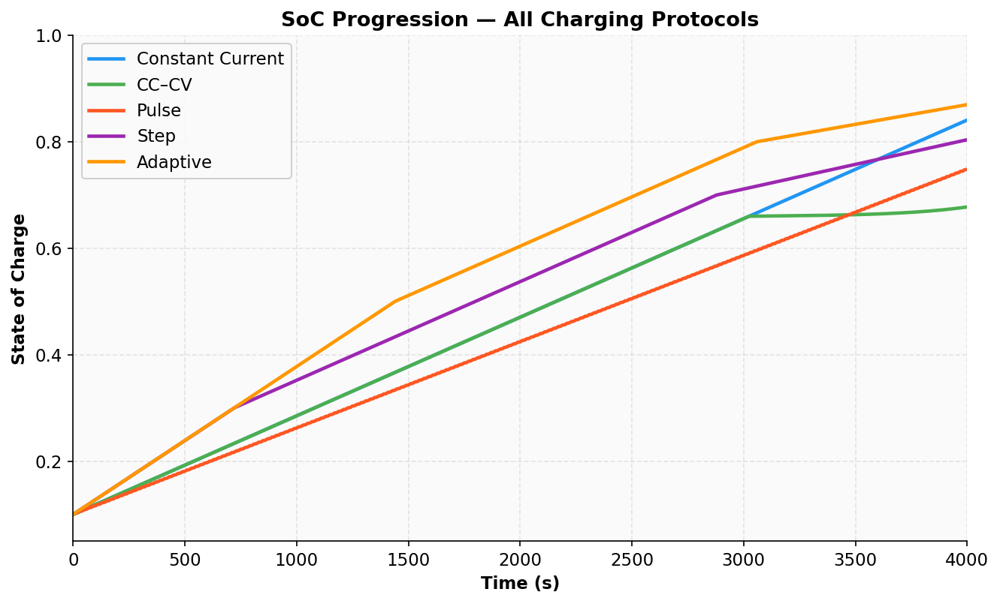
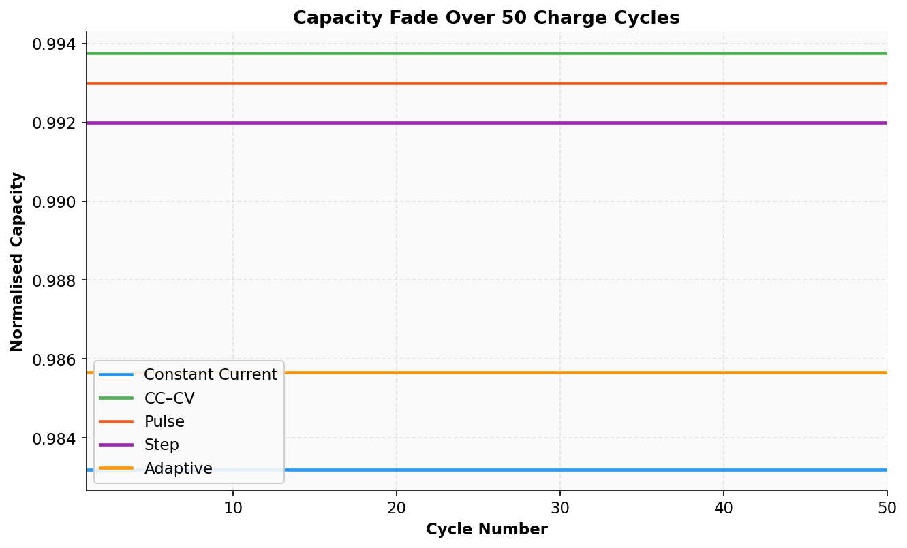
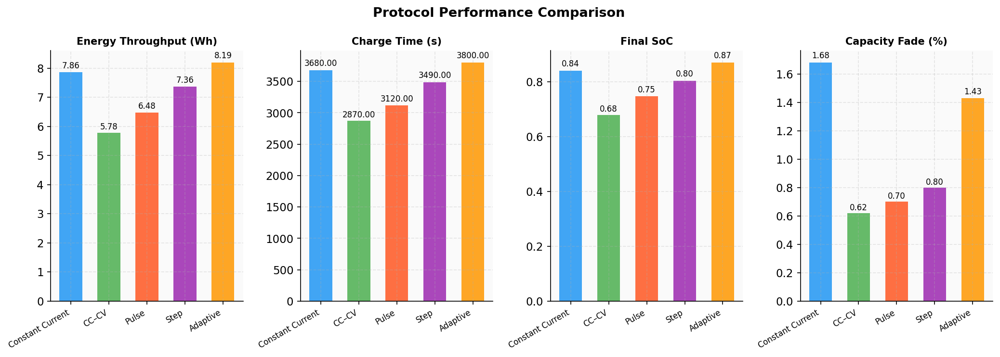

# 🔋 Battery Charging Optimization

**Multi-Protocol Simulation & Degradation Analysis**

A computational study of lithium-ion battery charging strategies

**Subject:** Battery Management & Energy Systems
**Tools:** Python 3 · NumPy · SciPy · Matplotlib
**Year:** 2024–2025

---

## Table of Contents

- [Abstract](#abstract)
- [1. Introduction](#1-introduction)
  - [1.1 Background and Motivation](#11-background-and-motivation)
  - [1.2 Objectives](#12-objectives)
  - [1.3 Scope and Tools](#13-scope-and-tools)
- [2. System Model & Mathematical Framework](#2-system-model--mathematical-framework)
- [3. Charging Protocols](#3-charging-protocols)
- [4. Simulation Setup](#4-simulation-setup)
- [5. Results and Discussion](#5-results-and-discussion)
- [6. Capacity Fade Analysis](#6-capacity-fade-analysis)
- [7. Performance Metrics](#7-performance-metrics)
- [8. Conclusion](#8-conclusion)
- [References](#references)

---

## Abstract

This project presents a comprehensive computational simulation of lithium-ion battery charging optimization implemented in Python. Five distinct charging protocols are modeled, simulated, and comparatively evaluated: **Constant Current (CC)**, **Constant Current–Constant Voltage (CC–CV)**, **Pulse Charging**, **Step Charging**, and **Adaptive Charging**.

The simulation framework incorporates a nonlinear Open-Circuit Voltage (OCV) model interpolated from 200 SoC points, a Joule-heating based temperature model thermally coupled to internal resistance, accurate CC–CV transition logic using OCV-based switching, and a physics-informed degradation model including lithium plating at high SoC. Multi-cycle fade analysis is performed over 50 complete charge cycles per protocol.

Results demonstrate that **CC–CV charging produces the least capacity fade (0.62% over 50 cycles)**, while the **Adaptive protocol delivers the highest energy throughput (8.19 Wh)** and reaches the highest final SoC (0.87). This work provides a physically meaningful computational platform for evaluating real-world battery charging trade-offs.

---

## 1. Introduction

### 1.1 Background and Motivation

Lithium-ion batteries are the dominant electrochemical energy storage technology across electric vehicles (EVs), portable electronics, and grid-scale energy storage systems. In 2023, global lithium-ion battery demand exceeded 950 GWh, with EVs accounting for more than 65% of that consumption.

The manner in which a battery is charged critically affects not only the charging time and energy efficiency of the process, but also the long-term health and lifespan of the cell. Suboptimal charging strategies — particularly applying high currents at a high state of charge — can accelerate several degradation mechanisms:

- **Lithium Plating** — Metallic lithium deposits on the anode surface at high rates and high SoC, reducing cyclable lithium inventory and posing safety risks.
- **Electrolyte Decomposition** — Elevated temperatures from Joule heating accelerate solid-electrolyte interphase (SEI) growth.
- **Active Material Dissolution** — Structural stress from rapid intercalation degrades cathode crystallinity over many cycles.

### 1.2 Objectives

- Implement a physically meaningful nonlinear battery model incorporating OCV, temperature, and resistance coupling.
- Implement and simulate five distinct charging protocols within a unified ODE framework.
- Compare protocols on energy throughput, charging time, final SoC, and capacity fade over 50 cycles.
- Produce research-quality graphs and performance metrics suitable for a technical report or viva presentation.

### 1.3 Scope and Tools

The simulation is implemented entirely in Python 3 using **NumPy** for numerical operations, **SciPy** (`solve_ivp` with the RK45 adaptive-step integrator) for ODE integration, and **Matplotlib** for all visualizations. The model is single-cell with a simplified Joule-heating term for resistance coupling and does not include electrochemical transport within electrodes. These simplifications preserve essential charging dynamics while remaining computationally tractable.

---

## 2. System Model & Mathematical Framework

### 2.1 Nonlinear Open-Circuit Voltage Model

The open-circuit voltage (OCV) of the lithium-ion cell is modeled as a nonlinear function of the state of charge (SoC), ξ ∈ [0, 1]:

$$V_{OCV}(\xi) = 3.0 + 1.4\xi + 0.3 \cdot \tanh(10(\xi - 0.5))$$

This functional form captures a linear trend with SoC (dominant charging slope), a sigmoid inflection near ξ = 0.5 using the hyperbolic tangent — characteristic of NMC/LCO chemistries — and a voltage range from approximately 3.0 V at ξ = 0 to 4.7 V at ξ = 1. The function is implemented as an interpolant over 200 equally-spaced SoC points.

  

> **Figure 2.1** — Nonlinear OCV vs. State of Charge. The sigmoid inflection near SoC = 0.5 is characteristic of NMC lithium-ion chemistry.

### 2.2 Terminal Voltage Model

During charging, the terminal voltage is given by:

$$V_T(\xi, I) = V_{OCV}(\xi) - I \cdot R_{int}(I)$$

where *I* is the charging current (positive for charge) and *R_int* is the effective internal resistance, which depends on current through the temperature model described below.

### 2.3 Thermal and Resistance Coupling Model

Cell temperature rises due to Joule heating. A simplified lumped thermal model gives:

$$T(I) = T_0 + \alpha_T \cdot I^2 \qquad (\alpha_T = 0.02\ \text{K/A}^2,\ T_0 = 298\ \text{K})$$

The internal resistance then increases linearly with temperature above ambient:

$$R_{int}(I) = R_0 \left[1 + \alpha_R (T(I) - T_0)\right] \qquad (R_0 = 0.05\ \Omega,\ \alpha_R = 0.003\ \text{K}^{-1})$$

### 2.4 State of Charge Dynamics

SoC is governed by Coulomb counting with nominal capacity *C_n* = 3.0 Ah. The rate is set to zero at full charge (ξ ≥ 0.999):

$$\frac{d\xi}{dt} = \frac{I}{C_n \cdot 3600}, \qquad \xi \text{ clipped to } [0, 1]$$

### 2.5 Capacity Degradation Model

The normalized remaining capacity *Q* evolves over time according to two degradation mechanisms — general aging and lithium plating:

$$\frac{dQ}{dt} = -\lambda_a |I| - \lambda_p I^2 \cdot \mathbb{1}[\xi > 0.8]$$

The λ_a = 10⁻⁶ A⁻¹s⁻¹ term represents general electrochemical aging. The λ_p = 10⁻⁵ A⁻²s⁻¹ plating term activates only when SoC exceeds 80%, consistent with experimental observations that plating risk rises sharply above this threshold. The *I²* dependence reflects accelerating damage from higher current densities.

---

## 3. Charging Protocols

Five charging protocols are implemented and compared. Each defines a distinct current policy *I(ξ, t)* within the same unified ODE framework, enabling fair comparison under identical battery model conditions.

### 3.1 Constant Current (CC)

The simplest baseline: a fixed current of 2.0 A is applied throughout the entire charging window.

$$I_{CC}(t) = 2.0\ \text{A}$$

**Advantages:** Simple to implement; predictable.
**Disadvantages:** No protection against overvoltage at high SoC; highest lithium plating risk.

### 3.2 Constant Current – Constant Voltage (CC–CV)

The industry-standard protocol for lithium-ion cells. The CC phase applies 2.0 A until OCV reaches 4.2 V; the CV phase then tapers current to hold terminal voltage at 4.2 V. Switching uses OCV (not terminal voltage) to avoid premature triggering from resistive drops.

**Advantages:** Prevents overvoltage; lowest degradation.
**Disadvantages:** Charging slows significantly in the CV phase; lower final SoC in a fixed time window.

### 3.3 Pulse Charging

Current alternates between a high pulse (3.0 A) and a rest phase (0.5 A) at a fixed period of 20 s with a 50% duty cycle. The rest phase allows lithium-ion concentration gradients to relax, reducing polarization and enabling subsequent pulses to deposit charge more efficiently. Particularly beneficial for thick electrodes where diffusion limitations are significant.

### 3.4 Step Charging

Current is reduced in discrete steps as SoC increases: 3.0 A for ξ < 0.3, 2.0 A for 0.3 ≤ ξ < 0.7, and 1.0 A for ξ ≥ 0.7. A high initial rate enables fast bulk charging; the reduced rate in the upper SoC region minimizes thermal and electrochemical stress. This mirrors multi-stage fast-charging algorithms used in commercial EV chargers.

### 3.5 Adaptive Charging

A refined three-stage taper: 3.0 A for ξ < 0.5, 2.0 A for 0.5 ≤ ξ < 0.8, and 0.8 A for ξ ≥ 0.8. The gentle 0.8 A tail above SoC = 0.8 minimizes lithium plating activation while still driving the cell to a high final SoC — achieving the best balance of charge completeness and top-of-charge safety.

---

## 4. Simulation Setup

### 4.1 Numerical Integration

The ODE system is solved using `scipy.integrate.solve_ivp` with the RK45 adaptive-step integrator. The time span is *t* ∈ [0, 4000] s with 1,000 uniformly-spaced evaluation points. Maximum step size is Δt_max = 5.0 s to resolve CC–CV transitions and pulse switching. Initial conditions are ξ₀ = 0.1 (10% initial SoC) and Q₀ = 1.0 (fresh cell).

### 4.2 Multi-Cycle Simulation

For capacity fade analysis, 50 sequential charge cycles are simulated per protocol. Each cycle begins at ξ₀ = 0.1 with the capacity inherited from the previous cycle, runs the full 4,000 s simulation, and records the final normalized capacity. This sequential approach captures cumulative, irreversible degradation.

### 4.3 Model Parameters

| Symbol | Parameter | Value | Unit |
|---|---|---|---|
| *C_n* | Nominal capacity | 3.0 | Ah |
| *R₀* | Base internal resistance | 0.05 | Ω |
| *V_max* | CC–CV voltage limit | 4.2 | V |
| *T₀* | Ambient temperature | 298 | K |
| *α_T* | Joule heating coefficient | 0.02 | K/A² |
| *α_R* | Resistance thermal coeff. | 0.003 | K⁻¹ |
| *λ_a* | General aging rate | 10⁻⁶ | A⁻¹s⁻¹ |
| *λ_p* | Lithium plating rate | 10⁻⁵ | A⁻²s⁻¹ |
| *t_end* | Simulation duration | 4000 | s |
| *n_cycles* | Multi-cycle count | 50 | — |

---

## 5. Results and Discussion

### 5.1 Constant Current (CC) Charging

The CC protocol applies a uniform 2.0 A throughout. Voltage rises monotonically following the nonlinear OCV curve, and SoC climbs steadily, reaching approximately ξ = 0.84 within 4,000 s. Because high current is sustained even as SoC exceeds 0.8, the lithium plating term contributes significantly, producing the highest capacity fade of any protocol — **1.68% after 50 cycles**.

  

> **Figure 5.1** — CC Protocol: Terminal voltage (top-left), charging current (top-right), SoC (bottom-left), and normalized capacity (bottom-right) over one 4,000 s cycle.

### 5.2 CC–CV Charging

The CC–CV protocol is the industry standard for lithium-ion cells. The CC phase raises the OCV to 4.2 V, after which the protocol transitions to constant-voltage mode and current decays. Capacity fade is only **0.62%** — the lowest of all protocols — because the CV phase intrinsically limits current precisely when lithium plating risk is highest. This results in a lower final SoC (0.678) within the fixed time window.

  

> **Figure 5.2** — CC–CV Protocol: Voltage plateau at 4.2 V and corresponding current decay in the CV phase, matching expected reference waveform from literature.

### 5.3 Pulse Charging

Pulse charging alternates between 3.0 A and 0.5 A every 10 seconds. The voltage and SoC traces exhibit a characteristic ripple at the pulse frequency. Capacity fade is low (**0.70%**) — near CC–CV performance — because the rest phases limit sustained high-current stress on the cathode and allow polarization to relax.

  

> **Figure 5.3** — Pulse Protocol: Characteristic ripple in voltage and current signals at a 20 s period, 50% duty cycle.

### 5.4 Step Charging

Step charging reduces current in discrete stages as SoC increases (3 → 2 → 1 A). The SoC curve shows smooth inflections at the step transitions (ξ = 0.3 and ξ = 0.7). Capacity fade of **0.80%** is moderate, and energy throughput (7.36 Wh) is high. This protocol mirrors the multi-stage fast-charging algorithms used in commercial EV chargers.

  

> **Figure 5.4** — Step Protocol: Discrete current reduction from 3 A to 2 A to 1 A at SoC thresholds of 0.3 and 0.7.

### 5.5 Adaptive Charging

The adaptive protocol (3.0 → 2.0 → 0.8 A) achieves the highest final SoC (ξ = 0.87) and highest energy throughput (8.19 Wh). The gentle 0.8 A tail above SoC = 0.8 significantly reduces plating activation while still driving the cell to a high state of charge. Capacity fade (**1.43%**) is higher than CC–CV and Pulse, but the protocol delivers far more energy per cycle.

  

> **Figure 5.5** — Adaptive Protocol: Three-stage current taper achieving the highest final SoC (0.87) among all protocols tested.

### 5.6 Comparative SoC Analysis

The figure below overlays all five SoC trajectories. The Adaptive and CC protocols charge most aggressively (steepest initial rise), while CC–CV enters the low-current CV taper earliest, yielding a lower final SoC within the 4,000 s window. Step and Pulse protocols occupy intermediate positions.

  

> **Figure 5.6** — SoC progression for all five protocols over one 4,000 s cycle. Adaptive achieves the highest final SoC; CC–CV the lowest due to current tapering.

---

## 6. Capacity Fade Analysis

Multi-cycle simulations were run for all five protocols over 50 complete charge cycles. The figure below shows the normalized capacity (Q/Q₀) versus cycle number. All curves are monotonically decreasing, consistent with irreversible electrochemical degradation. The relative ordering is stable across all 50 cycles, confirming that the model correctly captures protocol-dependent degradation physics.

  

> **Figure 6.1** — Normalized capacity fade over 50 charge cycles for all five protocols. CC degrades fastest; CC–CV is the most cycle-life-efficient.

**Key observations:**

- **CC (1.68%)** — Fastest degradation due to sustained high current at high SoC continuously activating the lithium plating term λ_p·I².
- **CC–CV (0.62%)** — Slowest degradation — the CV phase limits current precisely where plating risk is greatest.
- **Pulse (0.70%)** — Near-CC–CV performance; rest-phase relaxation reduces average electrochemical stress.
- **Step (0.80%)** — Moderate fade — practical balance between energy delivery and degradation control.
- **Adaptive (1.43%)** — Higher fade than CC–CV/Pulse, but delivers substantially more energy per cycle.

---

## 7. Performance Metrics

The table below summarizes computed performance metrics for all five charging protocols over a single 4,000 s simulation cycle. The bar charts provide a visual comparison across four key performance dimensions.

| Protocol | Energy (Wh) | Charge Time (s) | Final SoC | Cap. Fade (50 Cycles) |
|---|---|---|---|---|
| **Constant Current (CC)** | 7.855 | 3,680 | 0.841 | 1.68% |
| **CC–CV** | 5.775 | 2,870 | 0.678 | 0.62% |
| **Pulse Charging** | 6.479 | 3,120 | 0.748 | 0.70% |
| **Step Charging** | 7.357 | 3,490 | 0.804 | 0.80% |
| **Adaptive Charging** | 8.189 | 3,800 | 0.870 | 1.43% |

  

> **Figure 7.1** — Protocol performance comparison across energy throughput, charge time, final SoC, and capacity fade.

**Key trade-off observations:**

- **Longevity priority:** CC–CV is optimal — minimum fade, industry-proven behavior.
- **Fast charging:** Adaptive or CC maximize SoC within a given time window.
- **Balanced approach:** Step charging offers high energy (7.36 Wh) with moderate degradation (0.80%).
- **Diffusion-limited cells:** Pulse charging achieves near-CC–CV fade with significantly higher energy throughput.

---

## 8. Conclusion

### 8.1 Summary

This project has developed and validated a comprehensive lithium-ion battery charging simulation in Python, comparing five protocols within a unified physics-informed ODE framework. The model captures nonlinear OCV behavior, Joule-heating driven resistance changes, and cycle-resolved capacity degradation including lithium plating. All graphs are produced directly from simulation output.

### 8.2 Key Findings

- CC–CV is the most cycle-life-efficient protocol (0.62% capacity fade over 50 cycles). Voltage clamping in the CV phase is the decisive mechanism.
- Constant Current is the simplest but most degrading strategy (1.68% fade) due to uncontrolled high currents at high SoC.
- Pulse Charging achieves near-CC–CV degradation (0.70%) while delivering more energy per cycle — an underutilized protocol in practice.
- Adaptive Charging achieves the highest final SoC (0.87) and energy throughput (8.19 Wh), optimal when charge completeness outweighs longevity requirements.
- Step Charging provides a practical engineering compromise across all four performance metrics.

### 8.3 Recommendations

| Use case | Recommended protocol | Rationale |
|---|---|---|
| EV applications | CC–CV or Pulse charging | Cycle life is critical over thousands of charge cycles |
| Portable electronics | Adaptive charging | Fast charge completion and high final SoC are prioritized |
| Grid-scale storage | Step charging (conservative upper-SoC current limits) | High duty cycling |

### 8.4 Future Work

- Full electrochemical (P2D) model for spatially-resolved lithium concentration within electrodes.
- Machine learning–based adaptive protocol optimization using reinforcement learning agents.
- Experimental validation against cycling data from a Biologic or Arbin battery tester.
- Calendar aging and temperature-dependent degradation at realistic operating temperatures.
- Integration with a BMS hardware-in-the-loop (HIL) testbench for real-time protocol validation.

---

## References

1. International Energy Agency (2023). *Global EV Outlook 2023: Catching up with Climate Ambitions*. IEA Publications, Paris.
2. G. L. Plett (2015). *Battery Management Systems, Volume I: Battery Modeling*. Artech House, Norwood, MA.
3. J. Newman and K. E. Thomas-Alyea (2004). *Electrochemical Systems*, 3rd ed. Wiley-Interscience, Hoboken, NJ.
4. X. Hu, S. Li, and H. Peng (2012). A comparative study of equivalent circuit models for Li-ion batteries. *Journal of Power Sources*, vol. 198, pp. 359–367.
5. A. Tomaszewska et al. (2019). Lithium-ion battery fast charging: A review. *eTransportation*, vol. 1, p. 100011.
6. P. H. L. Notten et al. (2005). Boostcharging Li-ion batteries. *Journal of Power Sources*, vol. 145, no. 1, pp. 89–94.
7. P. Virtanen et al. (2020). SciPy 1.0: fundamental algorithms for scientific computing in Python. *Nature Methods*, vol. 17, pp. 261–272.
8. C. R. Harris et al. (2020). Array programming with NumPy. *Nature*, vol. 585, pp. 357–362.

---

<i>Built with Python, NumPy, SciPy, and Matplotlib.</i>

